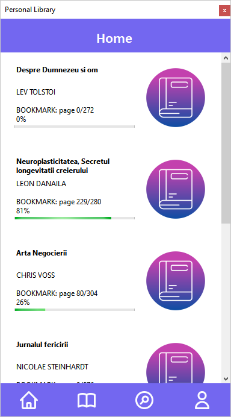
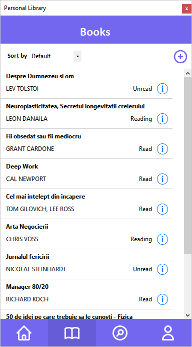

# Personal Library App

## Description
Personal Library App is a Windows Forms desktop application designed to help users manage their book collections efficiently. Users can add, edit, delete, and search for books within the application. The app features an intuitive user interface with dedicated sections for home, book management, searching, and future account management.

- [Application Diagram [PDF]](Documentation/ApplicationDiagram.pdf)

- [Project Wireframes [PDF]](Documentation/ApplicationWireframeDesign.pdf)

## Features
- **Home Page**: Displays books marked as 'Reading' or 'Unread' for a quick overview.
- **Book Management**: Add, edit, and delete books from your collection.
- **Search Functionality**: Search for books by title or author.
- **Sorting Options**: Sort books by title, author, or status.
- **Book Details**: View and modify book details.
- **System Tray Support**: The app minimizes to the system tray for easy access.
- **Settings Persistence**: Saves window location preferences.

## Home
The HOME screen displays unread and currently reading books, providing an overview of the reading status. Clicking on a book icon opens its details.
#### Home Screen


## Books
The BOOKS screen lists all books in the personal library. Here, you can sort books (Default, Title, Author, Status), edit book details, and add new books.
#### Books Screen


### Book Info
Clicking the info icon opens the book details, where users can edit, delete, or mark books as read/unread.
#### Book Info Screen


### Edit Book
In the edit book section, users can update book details and save the changes.
#### Edit Book Screen


### Add New Book
This section allows users to add new books to the library.
#### New Book Screen


## Search
The search section enables users to search for books by title or author.
#### Search Screen


## Account
The account section is currently a demo screen. Future iterations will include account creation and data synchronization.
#### Account Screen


## Application Minimization
When closed, the application runs in the background in the system tray. To exit, right-click the system tray icon and select "Exit."
#### System Tray Screen


## Project Structure
The frontend design and backend logic are separated into distinct projects.
#### Project Structure


## Technologies Used
- **C#** (Windows Forms for UI development)
- **.NET Framework**
- **PersonalLibraryApp.Backend** (Handles book data management)

## Installation
1. Clone the repository:
   ```sh
   git clone https://github.com/CristiMCV91/PersonalLibraryDesktopApp.git
   ```
2. Open the solution in Visual Studio.
3. Build and run the project.

## Usage
1. Launch the application.
2. Navigate between sections (Home, Books, Search, Account) using the menu.
3. Add new books by clicking the 'Add New Book' button.
4. Edit or delete books from the 'Books' section.
5. Use the search bar to find books by title or author.
6. Minimize the app to the system tray for background operation.

## Future Enhancements
- Export book lists to JSON/CSV.
- Database synchronization.
- User authentication.

## Contribution
Contributions are welcome! Fork the repository and submit a pull request with your improvements.

## License
This project is licensed under the MIT License.

## Development
- **Application Name**: Personal Library Desktop App
- **Version**: 1.0
- **Release Date**: 19.03.2025
- **Author / Student**: Cristian Macovei
- **Teacher**: Mihai Gonciar
- **Course**: C#
- **Academy**: IT School [IT School](https://itschool.ro)

